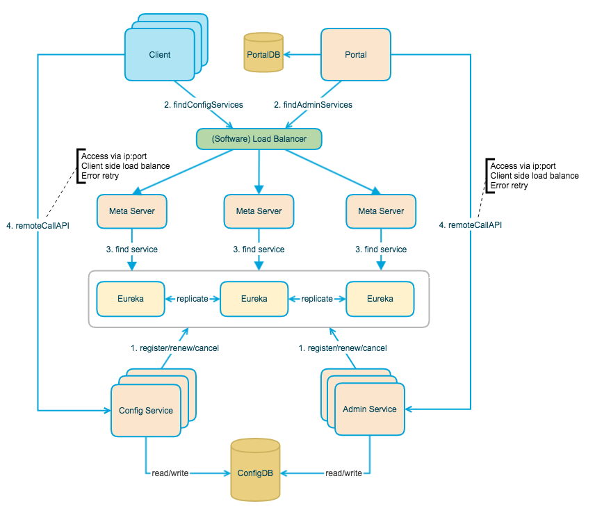
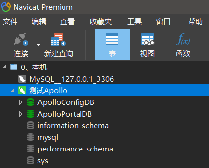
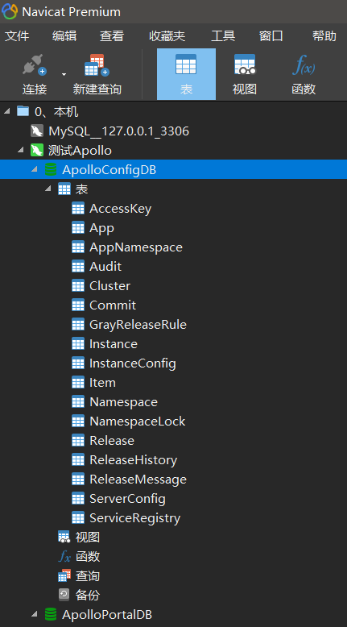
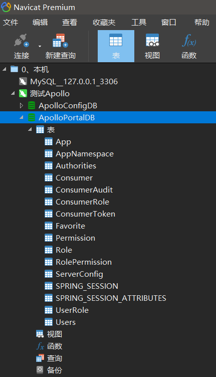
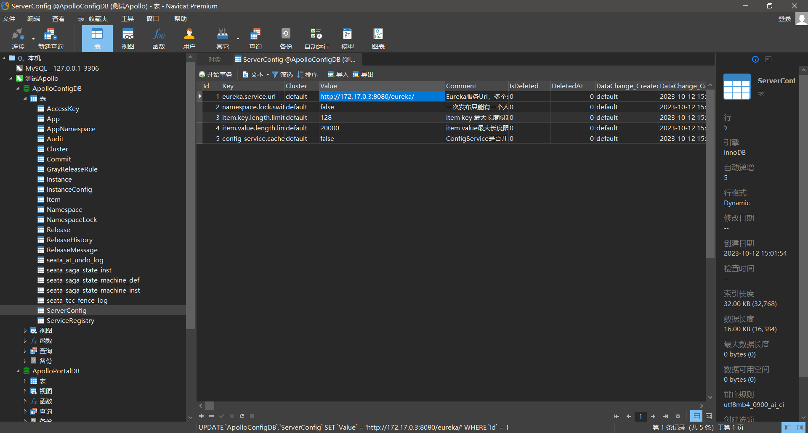
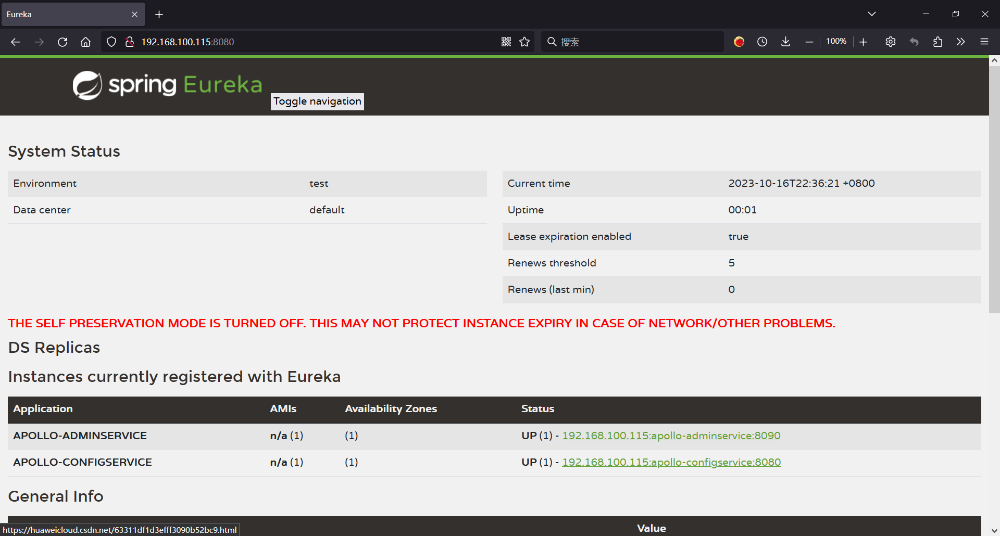

# Docker安装Apollo


## 一、Apollo架构设计


### 1.1、架构设计图




### 1.2、四个核心模块及其主要功能

#### 1.2.1、ConfigService

- 提供配置获取接口
- 提供配置推送接口
- 服务于Apollo客户端

#### 1.2.2、AdminService

- 提供配置管理接口
- 提供配置修改发布接口
- 服务于管理界面Portal

#### 1.2.3、Client

- 为应用获取配置，支持实时更新
- 通过MetaServer获取ConfigService的服务列表
- 使用客户端软负载SLB方式调用ConfigService

#### 1.2.4、Portal

- 配置管理界面
- 通过MetaServer获取AdminService的服务列表
- 使用客户端软负载SLB方式调用AdminService


### 1.3、三个辅助服务发现模块

#### 1.3.1、Eureka

- 用于服务发现和注册
- Config/AdminService注册实例并定期报心跳
- 和ConfigService住在一起部署

#### 1.3.2、MetaServer

- Portal通过域名访问MetaServer获取AdminService的地址列表
- Client通过域名访问MetaServer获取ConfigService的地址列表
- 相当于一个Eureka Proxy
- 逻辑角色，和ConfigService住在一起部署

#### 1.3.3、NginxLB

- 和域名系统配合，协助Portal访问MetaServer获取AdminService地址列表
- 和域名系统配合，协助Client访问MetaServer获取ConfigService地址列表
- 和域名系统配合，协助用户访问Portal进行配置管理


## 二、创建Apollo所需的数据库

> 注意：文章下面使用的IP地址 `192.168.100.115` 是我测试用的虚拟机的IP，大家可以根据自己的实际情况进行调整。

### 2.1、创建数据库

直接使用 `Apollo开源仓库中提供好的SQL文件` 进行创建即可：

- ApolloConfigDB：https://github.com/apolloconfig/apollo/blob/master/scripts/sql/apolloconfigdb.sql
- ApolloPortalDB：https://github.com/apolloconfig/apollo/blob/master/scripts/sql/apolloportaldb.sql

注：以上脚本，会自动创建database和表，如图：

#### 图1：


#### 图2：


#### 图3：



### 2.2、修改Eureka的地址

进入 `ApolloConfigDB` 数据库，找到 `ServiceConfig` 表，修改 `Eureka` 的地址为即将安装的 `Apollo Config Service` 的地址，否则下面部署Apollo时，将会抛出服务注册失败的异常。

修改后的样子如图：



## 三、下载Apollo镜像

```shell
docker pull apolloconfig/apollo-configservice:latest
docker pull apolloconfig/apollo-adminservice:latest
docker pull apolloconfig/apollo-portal:latest
```


## 四、运行Apollo容器

### 4.1、运行 Apollo Config Service

```shell
docker run \
    -d \
    -p 8080:8080 \
    -e SPRING_DATASOURCE_URL="jdbc:mysql://192.168.100.115:3306/ApolloConfigDB?characterEncoding=utf8" \
    -e SPRING_DATASOURCE_USERNAME=root \
    -e SPRING_DATASOURCE_PASSWORD=123456 \
    -e "EUREKA_INSTANCE_PREFERIPADDRESS=true" \
    -e "EUREKA_INSTANCE_IPADDRESS=192.168.100.115" \
    -e "EUREKA_INSTANCE_NONSECUREPORT=8080" \
    -e "EUREKA_INSTANCE_INSTANCEID=192.168.100.115:apollo-configservice:8080" \
    -v /tmp/logs:/opt/logs  \
    --name apollo-configservice \
    apolloconfig/apollo-configservice:latest

docker logs -f apollo-configservice

```

### 4.2、运行 Apollo Admin Service

```shell
docker run \
    -d \
    -p 8090:8090 \
    -e SPRING_DATASOURCE_URL="jdbc:mysql://192.168.100.115:3306/ApolloConfigDB?characterEncoding=utf8" \
    -e SPRING_DATASOURCE_USERNAME=root \
    -e SPRING_DATASOURCE_PASSWORD=123456 \
    -e "EUREKA_INSTANCE_PREFERIPADDRESS=true" \
    -e "EUREKA_INSTANCE_IPADDRESS=192.168.100.115" \
    -e "EUREKA_INSTANCE_NONSECUREPORT=8090" \
    -e "EUREKA_INSTANCE_INSTANCEID=192.168.100.115:apollo-adminservice:8090" \
    -v /tmp/logs:/opt/logs \
    --name apollo-adminservice \
    apolloconfig/apollo-adminservice:latest

docker logs -f apollo-adminservice

```

以上两个服务的容器都启动完成后，访问注册中心看一下两个服务是否都已注册成功：http://192.168.100.115:8080/

注册成功情况如图：


### 4.3、运行 Apollo Portal

```shell
docker run \
    -d \
    -p 8070:8070 \
    -e SPRING_DATASOURCE_URL="jdbc:mysql://192.168.100.115:3306/ApolloPortalDB?characterEncoding=utf8" \
    -e SPRING_DATASOURCE_USERNAME=root \
    -e SPRING_DATASOURCE_PASSWORD=123456 \
    -e APOLLO_PORTAL_ENVS=pro \
    -e PRO_META=http://192.168.100.115:8080 \
    -v /tmp/logs:/opt/logs \
    --name apollo-portal \
    apolloconfig/apollo-portal:latest

docker logs -f apollo-portal

```

#### 参数说明：

| 参数名                        | 参数说明                                                                                                                            |
|----------------------------|---------------------------------------------------------------------------------------------------------------------------------|
| SPRING_DATASOURCE_URL      | 对应环境ApolloConfigDB的地址                                                                                                           |
| SPRING_DATASOURCE_USERNAME | 对应环境ApolloConfigDB的用户名                                                                                                          |
| SPRING_DATASOURCE_PASSWORD | 对应环境ApolloConfigDB的密码                                                                                                           |
| APOLLO_PORTAL_ENVS(可选)     | 对应ApolloPortalDB中的apollo.portal.envs配置项，如果没有在数据库中配置的话，可以通过此环境参数配置                                                               |
| DEV_META/PRO_META(可选)      | 配置对应环境的Meta Service地址，以${ENV}_META命名，需要注意的是如果配置了ApolloPortalDB中的apollo.portal.meta.servers配置，则以apollo.portal.meta.servers中的配置为准 |


## 五、测试

访问地址：http://192.168.100.115:8070/

账号密码：apollo / admin


## 六、SpringBoot集成

> 此章节内容待完善

<!--

集成源代码（Demo）： ms-config-center: ms-config-center

```yaml
server:
  port: 18081
#Apollo应用
app:
  id: sprintboot-apollo-test  #使用的 Apollo 的项目（应用）编号
apollo:
  meta: http://192.168.100.115:8080 #Apollo Meta Server 地址
  cacheDir: ./ms-config-apollo/config
  bootstrap:
    enabled: true   #是否开启 Apollo 配置预加载功能。默认为 false。
    eagerLoad:
      enable: true  #是否开启 Apollo 支持日志级别的加载时机。默认为 false。
    namespaces: application

test:
  key: xiaxinyu
```
-->