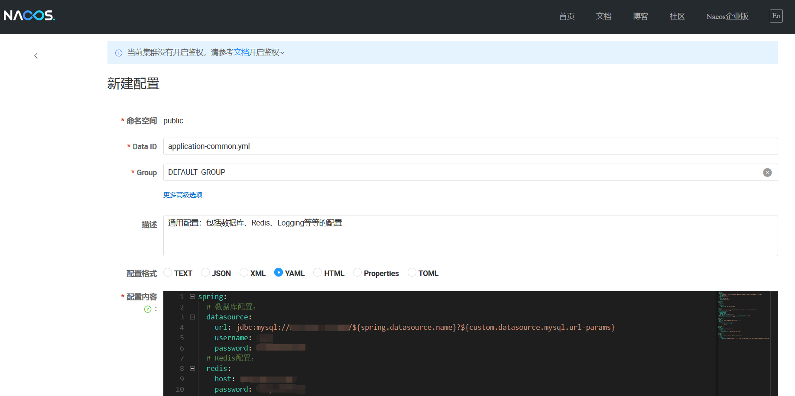
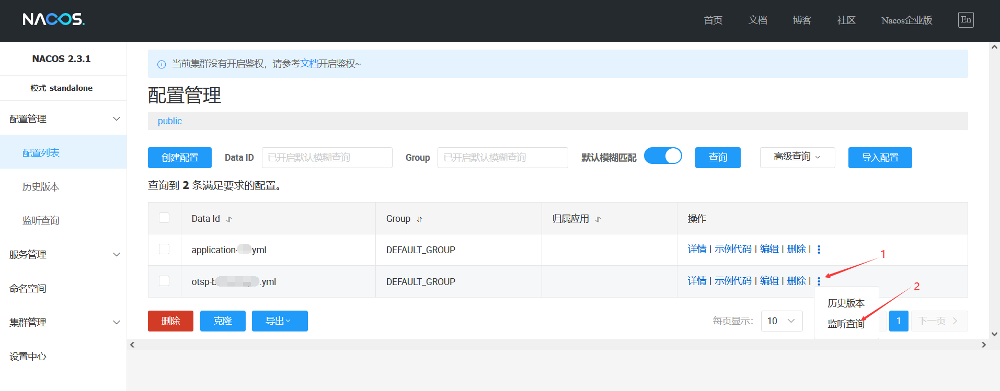
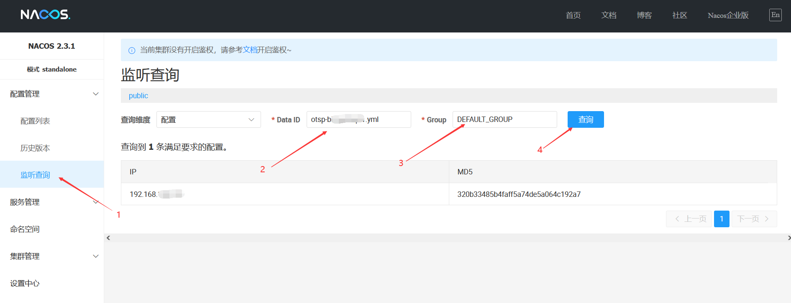

# SpringCloud集成Nacos


## 一、Nacos官网
https://nacos.io


## 二、下载Nacos镜像

```shell
docker pull nacos/nacos-server:v2.3.1
```


## 三、运行Nacos容器

### 3.1、启用Nacos容器命令：

> 注：8848为HTTP端口（含控制台和HTTP接口），9848为RPC端口。

```shell
docker run \
  -d \
  --name nacos \
  -p 8848:8848 \
  -p 9848:9848 \
  -e MODE=standalone \
  nacos/nacos-server:v2.3.1

docker logs -f nacos

```

### 3.2、参数配置说明（环境变量配置说明）：
https://nacos.io/docs/latest/quickstart/quick-start-docker/#common-property-configuration


## 四、测试是否部署成功

访问地址：https://127.0.0.1:8848/nacos

### 4.1、登录：

账号密码：<br>
- 高版本：默认未启用鉴权，可直接进入<br>
- 低版本：默认账号密码：nacos / nacos

### 4.2、新建配置文件：



## 五、SpringCloud应用集成Nacos

### 5.1、引用Nacos依赖

```xml
<project>
    ......
    
    <properties>
        <spring-cloud-alibaba.version>2.2.9.RELEASE</spring-cloud-alibaba.version>
    </properties>
    
    <dependencyManagement>
        <dependencies>
            <dependency>
                <groupId>com.alibaba.cloud</groupId>
                <artifactId>spring-cloud-alibaba-dependencies</artifactId>
                <version>${spring-cloud-alibaba.version}</version>
                <type>pom</type>
                <scope>import</scope>
            </dependency>
        </dependencies>
    </dependencyManagement>
    
    <dependencies>
        <!-- Nacos配置中心客户端 -->
        <dependency>
            <groupId>com.alibaba.cloud</groupId>
            <artifactId>spring-cloud-starter-alibaba-nacos-config</artifactId>
        </dependency>

        <!-- Nacos注册中心客户端 -->
        <!--<dependency>
            <groupId>com.alibaba.cloud</groupId>
            <artifactId>spring-cloud-starter-alibaba-nacos-discovery</artifactId>
        </dependency>-->
    </dependencies>
    
    ......
</project>
```

### 5.2、应用端配置文件中，添加nacos配置

```yaml
spring:
  cloud:
    nacos:
      discovery:
        server-addr: 127.0.0.1:8848 # nacos注册中心地址
      config:
        server-addr: 127.0.0.1:8848 # nacos配置中心地址
        username: nacos # nacos账号，默认情况下，低版本nacos-server必须要配置此项
        password: nacos # nacos密码，默认情况下，低版本nacos-server必须要配置此项
        group: DEFAULT_GROUP # 配置分组
        refresh-enabled: true # 是否开启配置热加载
        # 一组共享配置：多个应用共用的配置文件，可添加在这里
        shared-configs:
          - data-id: application-common.yml # 共享配置文件名称
            group: DEFAULT_GROUP # 配置分组
            file-extension: yml # 配置文件后缀名
            refresh: true # 是否开启配置热加载
        # 一组扩展配置：当前应用的扩展配置文件，可添加在这里
        extension-configs:
          - data-id: application-bill.yml # 扩展配置文件名称
            group: DEFAULT_GROUP # 配置分组
            file-extension: yml # 配置文件后缀名
            refresh: true # 是否开启配置热加载
```

### 5.3、配置类或SpringBean上，添加注解 `@RefreshScope`，允许配置热加载：

#### 1）配置类示例 - MyProperties.java：
```java
import lombok.Data;
import org.springframework.boot.context.properties.ConfigurationProperties;
import org.springframework.cloud.context.config.annotation.RefreshScope;
import org.springframework.stereotype.Component;

@Data
@Component
@RefreshScope
@ConfigurationProperties(prefix = "my")
public class MyProperties {
   private String name;
   private String age;
}
```

#### 2）SpringBean示例 - MyController.java：
```java
import javax.annotation.Resource;

import org.springframework.beans.factory.annotation.Value;
import org.springframework.cloud.context.config.annotation.RefreshScope;
import org.springframework.stereotype.Component;
import org.springframework.web.bind.annotation.GetMapping;
import org.springframework.web.bind.annotation.RestController;

@Component
@RefreshScope
@RestController
public class MyController {
   @Resource
   private MyProperties myProperties;

   @Value("${my.age2:0}")
   private Integer myAge2;


   @GetMapping("/my")
   public MyProperties getMyProperties() {
      return this.myProperties;
   }

   @GetMapping("/my-age2")
   public String getMyAge2() {
      return this.myAge2;
   }

}
```


## 六、测试配置中心，及配置热加载：
1. 在Nacos中，新建配置文件：application-my.yml，内容如下：
   ```yaml
   my:
     name: wangliang1024
     age: 30
     age2: 31
   ```
2. 启用应用后并访问以下链接查看当前配置：
  - 访问：http://127.0.0.1:8080/my ，响应：{"name":"wangliang1024","age":30}
  - 访问：http://127.0.0.1:8080/my-age2 ，响应：31
3. 再在Nacos中，修改配置文件application-my.yml，内容如下：
   ```yaml
   my:
     name: wangliang1024-2
     age: 31
     age2: 32
   ```
4. 然后，访问以下链接查看配置是否更新：
  - 访问：http://127.0.0.1:8080/my ，响应：{"name":"wangliang1024-2","age":31}
  - 访问：http://127.0.0.1:8080/my-age2 ，响应：32


## 七、查看配置文件的监听列表：
1. 方式1：


2. 方式2：



## 八、开发进阶：订阅配置变更事件

在SpringCloud实现监听器接口：
```java
import javax.annotation.Resource;

import lombok.extern.slf4j.Slf4j;
import org.springframework.cloud.context.environment.EnvironmentChangeEvent;
import org.springframework.context.ApplicationListener;
import org.springframework.core.env.ConfigurableEnvironment;
import org.springframework.stereotype.Component;

@Slf4j
@Component
public class MyConfigChangeListener implements ApplicationListener<EnvironmentChangeEvent> {

    @Resource
    private ConfigurableEnvironment environment;

    @Override
    public void onApplicationEvent(EnvironmentChangeEvent event) {
        for (String key : event.getKeys()) {
            log.info("EvnChangeListener key:{} value:{}", key, environment.getProperty(key));

            // do something
            // ......
        }
    }
}
```